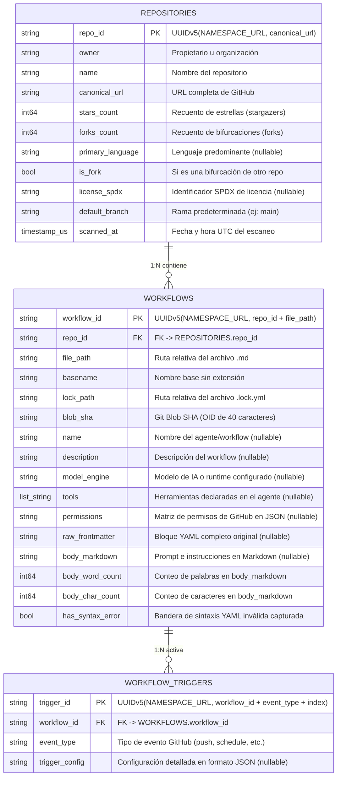

# 🏛️ Diagrama Entidad-Relación (ER) - PeakyMiner

Este documento describe el modelo de datos relacional para la persistencia del dataset de **GitHub Agentic Workflows (GH-AW)** en formato **Apache Parquet**.

---

## 1. Diagrama Entidad-Relación (Mermaid)

---

## 2. Cardinalidades y Relaciones

### Relación `REPOSITORIES` -> `WORKFLOWS` (1:N)
- **Cardinalidad:** Un repositorio puede albergar **cero, uno o múltiples** flujos de trabajo de agentes (`0..N`). Cada flujo de trabajo pertenece de forma estricta y exclusiva a un único repositorio (`1..1`).
- **Clave Foránea:** `WORKFLOWS.repo_id` referencia directamente a `REPOSITORIES.repo_id`.

### Relación `WORKFLOWS` -> `WORKFLOW_TRIGGERS` (1:N)
- **Cardinalidad:** Un workflow de agente puede activarse mediante **cero, uno o múltiples** eventos o disparadores de GitHub (`0..N`, ej. activación por `push`, `pull_request`, `schedule` con cron, o `workflow_dispatch`). Cada disparador corresponde exclusivamente a un único workflow (`1..1`).
- **Clave Foránea:** `WORKFLOW_TRIGGERS.workflow_id` referencia a `WORKFLOWS.workflow_id`.

---

## 3. Justificación de Normalización y Decisiones de Diseño

1. **Tercera Forma Normal (3NF):**
   - El modelo separa los metadatos de repositorio, las especificaciones del workflow y los eventos de disparo en entidades independientes. Se elimina la redundancia de datos (ej. replicar estrellas o lenguaje en cada workflow del mismo repo).
   - Los disparadores se desnormalizan en una tabla independiente (`WORKFLOW_TRIGGERS`) porque la especificación `on:` en GitHub Actions soporta múltiples eventos heterogéneos, listas de eventos y configuraciones anidadas (filtros de ramas, expresiones cron). Almacenarlos en una tabla dedicada facilita consultas analíticas como *"¿cuántos agentes se ejecutan con cron?"* o *"¿qué eventos son más comunes en flujos agénticos?"*.

2. **Claves Primarias Deterministas (UUIDv5):**
   - Se emplea `uuid.uuid5(uuid.NAMESPACE_URL, ...)` en lugar de auto-incrementales o UUIDv4 aleatorios.
   - **Idempotencia:** Si un repositorio o workflow es re-analizado en diferentes ejecuciones o máquinas, el `repo_id`, `workflow_id` y `trigger_id` resultantes serán idénticos.
   - **Independencia de Secuencia:** Permite la construcción concurrente de DataFrames y tablas Parquet sin necesidad de coordinar secuencias numéricas globales en memoria o base de datos.

3. **Resiliencia de Esquema ante Errores de Sintaxis:**
   - La columna `WORKFLOWS.has_syntax_error` permite identificar qué flujos de trabajo tienen YAML frontmatter corrupto sin descartar el registro ni romper el pipeline de datos. El texto original se resguarda en `raw_frontmatter` y el prompt en `body_markdown`, dejando los campos estructurados en `None`.

